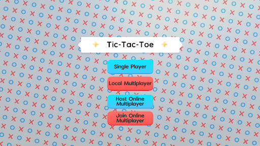
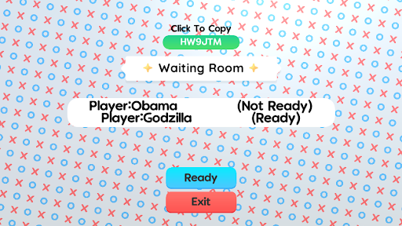
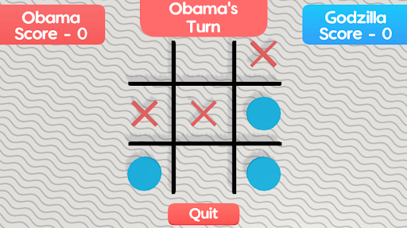

# TicTacToe Champions

A TicTacToe game built to experiment with Unity's new Netcode for GameObjects multiplayer functionality. Built in Unity. All paid assets have been removed.

## Play Now

Download the application for free on Windows, Mac and Linux from: 

  
  
  

## Features

### Multiple Game Modes

Play against an A.I. opponent in singleplayer or against a friend in both local and online multiplayer gamemodes!

### Online Multiplayer

Join and Host online lobbies to play with friends anywhere in the world over the internet!

## Dependencies

This project uses the following paid assets:

- [GUI PRO Kit - Simple Casual](https://assetstore.unity.com/packages/2d/gui/icons/gui-pro-kit-simple-casual-203399)
- [POLYGON Particle FX - Low Poly 3D Art by Synty](https://assetstore.unity.com/packages/vfx/particles/polygon-particle-fx-low-poly-3d-art-by-synty-168372)
- [Universal Sound FX](https://assetstore.unity.com/packages/audio/sound-fx/universal-sound-fx-17256)
